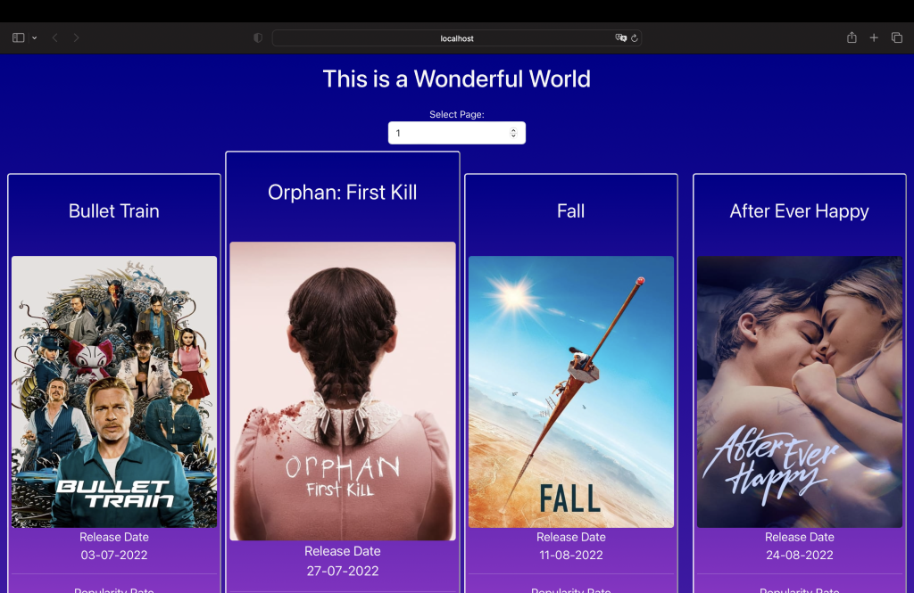
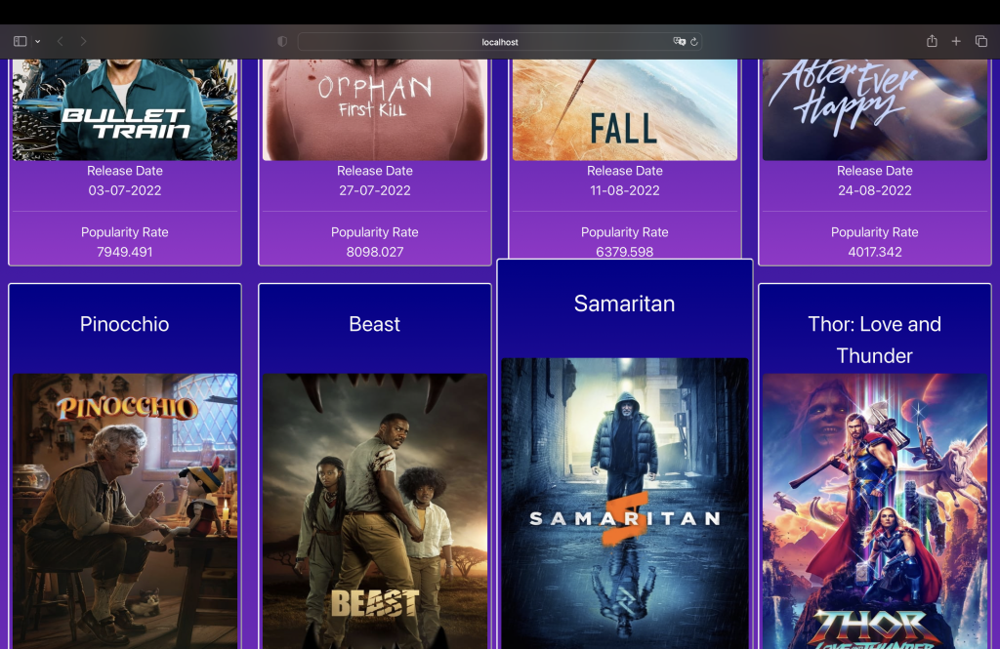
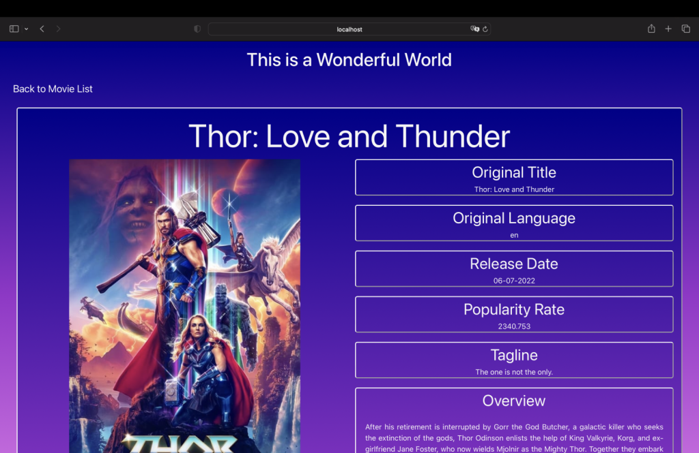

# react2coderstest App
## Introduction

This is a **Reactjs Application** built with a paginated list of the most popular movies as its main screen and a secondary one that shows more data about a selected item. It looks like this:

## Technical Details

- Base Techonology: Reactjs
- Functional components
- React router
- State management logic (context, redux (installed but not used. I must work more for understanding), ...)
- CSS using SASS (in a simple way)
- Packages installed apart the necessary for the previous functionalities:
	- Bootstrap (for responsive behaviour)
	- Moment (for date management).
